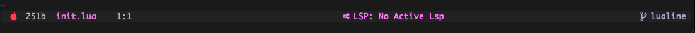

# This is my NeoVim config
## Features
- pure lua config (with external exceptions)
- mappings with focus on 'pure vim' experience
- options with focus twards programming
- custom made lualine (starting from evil line WIP)

### Shortcuts (getting started)
- ; = leader key
- <leader>hw	= Hop to word
- <ctrl>n	= open file tree
### Plugins
- [lualine](https://github.com/nvim-lualine/lualine.nvim)
- [hop](https://github.com/phaazon/hop.nvim)
- [packer]( https://github.com/wbthomason/packer.nvim )
- [diffview](https://github.com/sindrets/diffview.nvim)
- [ nvim-lsp ]( https://github.com/neovim/nvim-lspconfig )
- [ nvim-treesitter ]( https://github.com/nvim-treesitter/nvim-treesitter )
- [ nvim-tree ]( https://github.com/kyazdani42/nvim-tree.lua )
- [ trouble ]( https://github.com/folke/trouble.nvim )
- [ oxocarbon ]( https://github.com/shaunsingh/oxocarbon.nvim )
- [ nvim-ts-rainbow ]( https://github.com/p00f/nvim-ts-rainbow )
	- rainbow colored delimiters
- [ alpha ]( https://github.com/goolord/alpha-nvim )
## setup
1. use the [quick start file](https://github.com/snowmang1/nvim/blob/2c3e351dc346cf31cf38f3b870452286f08ec9e5/.quick_start.sh) to initialize your repo when you first clone.
	- or anytime I include a new lsp
2. go to your [packer plugin file](https://github.com/snowmang1/nvim/blob/2c3e351dc346cf31cf38f3b870452286f08ec9e5/lua/plugins.lua) and run `PackerSync` as a vim cmd.
3. The last step is to source your vim file and enjoy.

## Dependencies
- rust:latest
- [packer]( https://github.com/wbthomason/packer.nvim )
